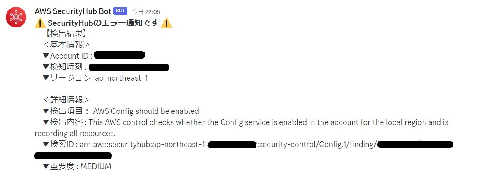

# discord_security_check
AWS SecurityHubの検出結果をDiscordに通知します

【discord側の準備】 
+ [公式ドキュメント](https://support.discord.com/hc/en-us/articles/228383668-Intro-to-Webhooks)を参考にWebhookURLを作成します。

【AWS側の準備】 
+ Lambda関数：discord_security_check_lambda.py 
   - web_hookのurlは置き換えてください。 
   - Lambda実行ロールはAWSマネージドの**AWSLambdaBasicExecutionRole**と**securityhub:BatchUpdateFindings**があれば動作します。 
+ EventBridgeルール：discord_security_check_event.json 
+ SecurityHubサンプル結果：security_check_sample.json 
   - Test実行するときのイベントとして利用できます。 

## 出力イメージ

